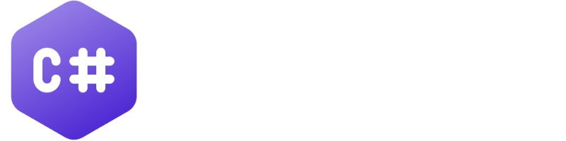

# CsharpExercises
an Archive of some C# exercises

### List of programs
- CD               
- ExerciseStringListArray
- Hangman
- PersoneProgram
- ProgramCartesianPlane
- ProgramResturant
- Reading&WritingFromTextFiles
- ChineseMorra
- FirdtStringProject
- Matrixs
- PiadinaStend
- ProgramDice
- ProgramSwitchesBulbs
- DeckItalianCards
- GuessNumber
- NutGame
- ProductManagement
- ProgramPuntoSegmentoCerchio
- ProgramTimeAppointment
- School
- GattileWPF
- SessioniAllenamento
- Shipments
